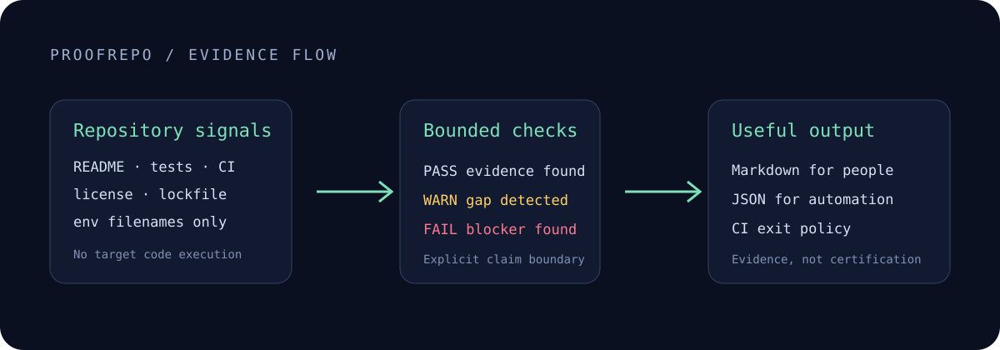

# ProofRepo

Evidence-first CLI for checking whether a software repository is ready to show recruiters, clients, or collaborators.

ProofRepo turns common repository signals into a compact Markdown or JSON report. It checks for a substantive README, license, manifest and lockfile, CI, test evidence, quality commands, environment-file hygiene, visual proof, demo links, and collaboration guidance.

It does **not** certify security, production readiness, compliance, ownership, or business outcomes. It reports only the evidence it can reproduce from the local repository.

## Why this exists

“Production-ready” and “high quality” are easy claims to write and difficult claims to trust. ProofRepo replaces those adjectives with inspectable facts and clear limitations. It is useful for:

- developers preparing a portfolio;
- maintainers improving an open-source repository;
- recruiters or reviewers who want a fast evidence map;
- teams creating a repeatable showcase checklist.

## Quick start

Requirements: Node.js 20 or newer.

```bash
npx proofrepo /path/to/repository
```

To run it against the repository you are standing in:

```bash
npx proofrepo .
```

To work on ProofRepo itself:

```bash
npm install
npm run check
node dist/cli.js /path/to/repository
```

## Output formats

Markdown to stdout:

```bash
proofrepo . --format markdown
```

JSON for automation:

```bash
proofrepo . --format json --output proofrepo.json
```

CI gate that fails on any warning or failure:

```bash
proofrepo . --fail-on warning
```

The default `--fail-on critical` exits non-zero only when a critical check fails. Use `--fail-on off` for reporting-only workflows.

## What is checked

| Area | Evidence used |
| --- | --- |
| Project explanation | Substantive root README |
| Reuse terms | Common license file |
| Reproducibility | Ecosystem manifest and lockfile |
| Automation | GitHub Actions workflow |
| Validation | Test script, test files, lint/typecheck/build commands |
| Environment hygiene | Env access, safe example file, tracked env filenames |
| Presentation | Screenshots, diagrams, README images, supporting links |
| Collaboration | CONTRIBUTING and SECURITY files |

ProofRepo never reads or prints `.env` values. It detects tracked environment files by filename only. This check is intentionally narrow and does not replace a secret scanner.

## How the evidence flow works



The scanner reads filenames, documented configuration, and supported source patterns. It deliberately avoids executing the target repository or printing secret values. Each check produces evidence, a status, and a recommendation; the renderer then emits the same report as Markdown or structured JSON.

## Validate this repository

```bash
npm ci
npm run check
node dist/cli.js . --format markdown --fail-on critical
```

## Library API

```ts
import { scanRepository, toMarkdown } from "proofrepo";

const report = scanRepository("/path/to/repository");
console.log(toMarkdown(report));
```

## Current status and limitations

ProofRepo is an early open-source CLI. Version 0.1 focuses on local repository evidence and GitHub Actions. It does not currently verify external links, execute the target repository's tests, inspect remote repository settings, scan commit history for secrets, or infer whether the author owns the code.

The score is a navigation aid, not a quality certification. Read the individual checks and claim boundary before making a decision.

## Contributing and security

See [CONTRIBUTING.md](CONTRIBUTING.md) for changes and [SECURITY.md](SECURITY.md) for private vulnerability reporting.

## License

MIT
